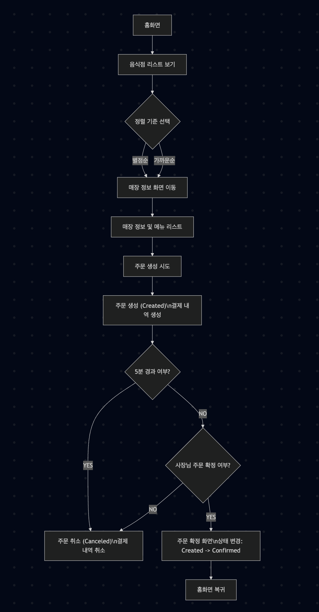
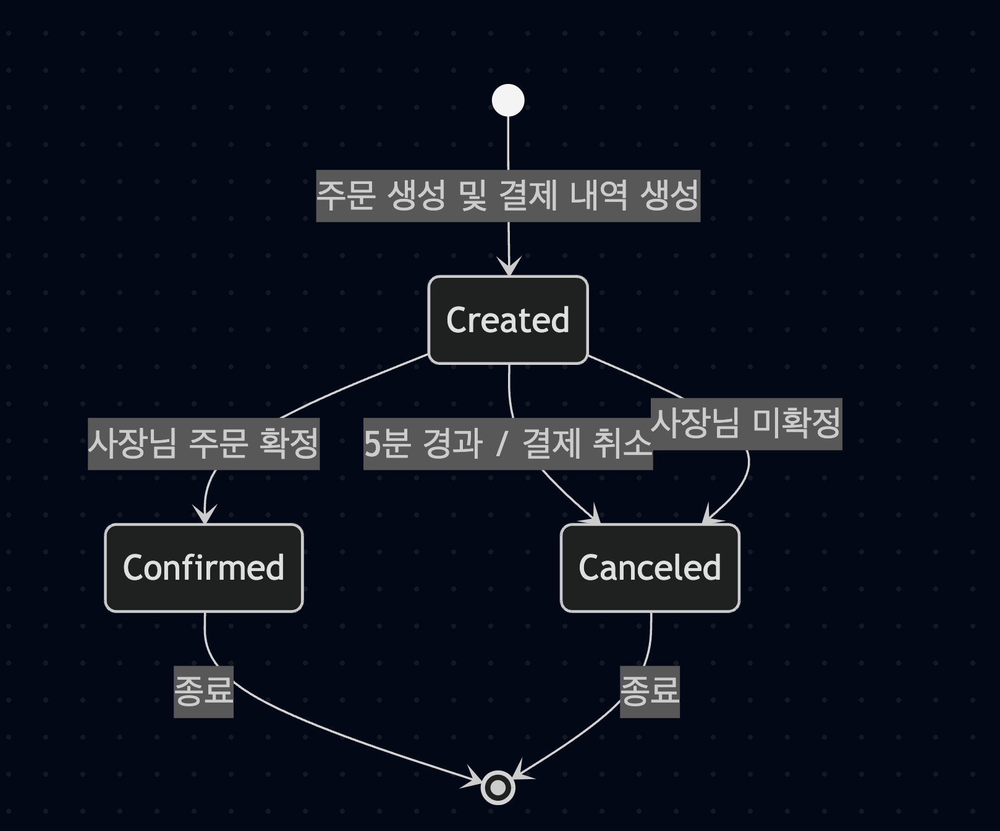
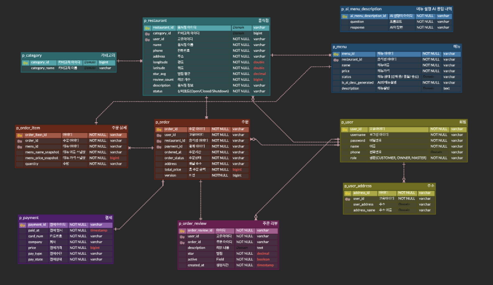
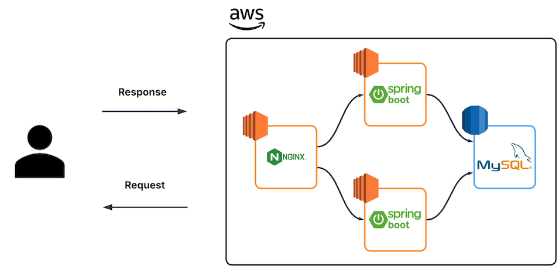
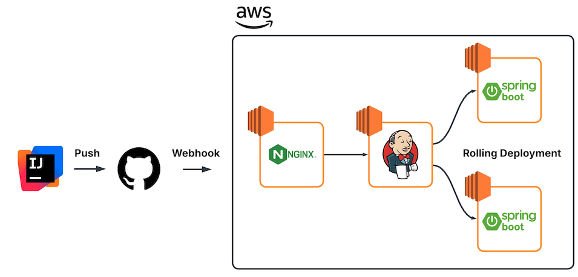

## 딜리버잇(Deliver-it)

- 사용자가 음식을 주문하고 음식점 사장님이 주문을 관리할 수 있는 배달 주문 관리 플랫폼입니다 

 

## 개발 환경 

- Language : Java 17 
- Framework : Spring Boot 3.5.6
- DB : MySQL 8.0
- CI/CD : AWS, Jenkins

 

## Flow chart 

- 사용자 화면 중심 

- 주문 상태 전이 

 

## ERD 

 

## Architecture

- AWS 환경 구성 (VPC, Security Group)
- 리버스 프록시 (nginx) 구성 
  - 무중단 배포를 위해 서버 앞단에 배치
- 서버 인스턴스 2대 (EC2 / t3.small)
  - 2 CPU / 2 GB

 

### CI/CD 구성 

- github webhook push event 구독 
- nginx 를 통해 git 접근 및 jenkins 접근 
- 서버 인스턴스 각각 롤링 배포 방식으로 배포 

 

## 팀원 

<table width="950px">
    <thead>
    </thead>
    <tr>
        <th>Picture</th>
        <td align="center"></td>
        <td align="center"></td>
        <td align="center"></td>
        <td align="center"></td>
        <td align="center"></td>
        <td align="center"></td>
    </tr>
    <tr>
        <th>Name</th>
        <td align="center">김지혜</td>
        <td align="center">이명규</td>
        <td align="center">허시영</td>
        <td align="center">조재희</td>
        <td align="center">유영우</td>
        <td align="center">김이안</td>
    </tr>
    <tr>
        <th>Position</th>
        <td align="center"><b>Leader</b> Backend </td>
        <td align="center"> Backend </td>
        <td align="center"> Backend </td>
        <td align="center"> Backend </td>
        <td align="center"> Backend </td>
        <td align="center"> Backend </td>
    </tr>
    <tr>
        <th>GitHub</th>
        <td align="center"></td>
        <td align="center"></td>
        <td align="center"></td>
        <td align="center"></td>
        <td align="center"></td>
        <td align="center"></td>
    </tr>
</table>

